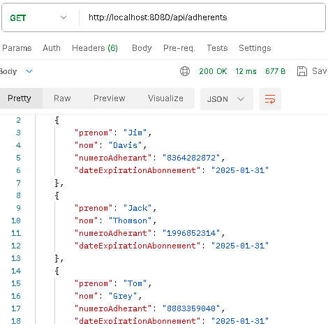
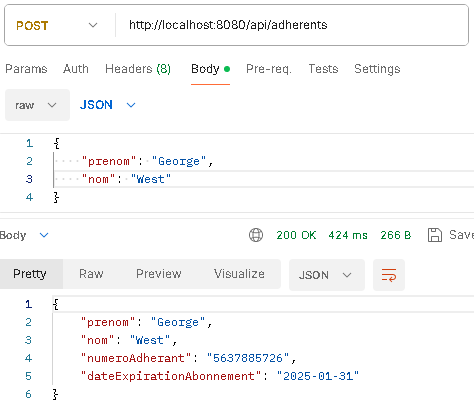
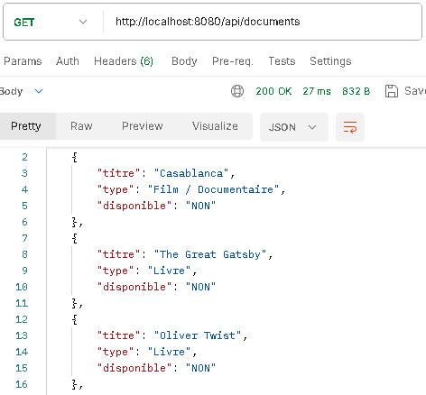
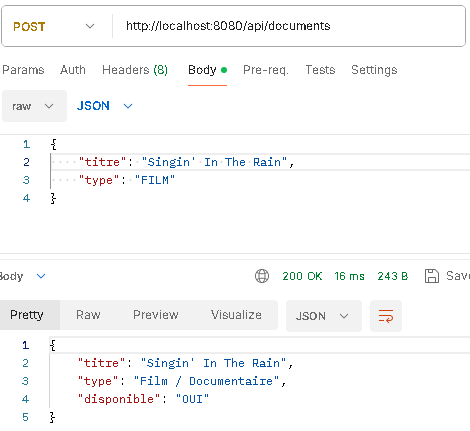
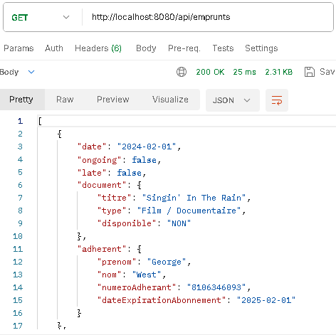
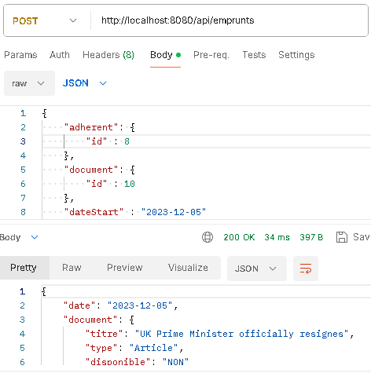
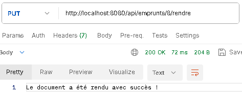
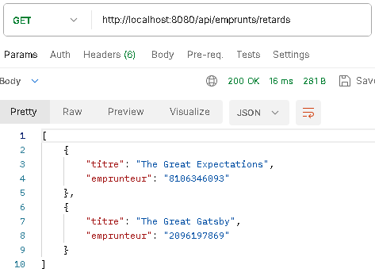

## TP Mediathèque
Créer un projet SpringBoot avec JPA et Spring Web \
On a besoin de 3 tables : adherents, documents, emprunts \
On a besoin d’une classe Service qui va manipuler la base de données \
On a besoin d’une classe qui va contenir les règles métier liées au fonctionnement de la médiathèque (et qu’on pourra tester avec des Tests Unitaires si nécessaire) 

#### Créer une API :
- GET /adherents 
- POST /adherents 
- GET /documents 
- POST /documents 
- GET /emprunts 
- POST /emprunts 

#### Règles métier :
- Un adhérent ne peut pas emprunter plus de 3 documents 
- Un adhérent ne peut pas emprunter si son adhesion est périmée 
- Un document ne peut être emprunté en même temps par plusieurs adhérents 

Aide pour les associations JPA:
1 Emprunt doit contenir 1 Adherent et 1 Document (ManyToOne)

#### Bonus 
- Pouvoir rendre un Document 
- Lister les documents en retards et les emails des adherents concernés 

### Solution :
#### GET ALL Adherent

#### POST Adherent

#### GET ALL Document

#### POST Document

#### GET ALL Emprunt

#### POST Emprunt

#### Bonus:
#### RENDRE DOCUMENT

#### DISPLAY LATE DOCUMENTS
